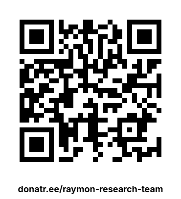

<div align="center">


**A compact, deterministic C++11 RTOS for ARM Cortex-M microcontrollers and STM32.**

[](LICENSE)
[]()
[]()
[]()

🌐 **[ZenOS RTOS Website](https://raymon-research-team.github.io/ZenOS-RTOS/)** · 📖 **[Interactive Documentation](https://raymon-research-team.github.io/ZenOS-RTOS/guide.html)** · ⚙️ **[STM32 RTOS Guide](https://raymon-research-team.github.io/ZenOS-RTOS/stm32-rtos.html)**

[**🇮🇷 فارسی**](docs/README_FA.md) | [**🇬🇧 English**](README.md)

</div>

---

## About ZenOS RTOS

**ZenOS** is a C++11 real-time operating system (RTOS) designed for embedded applications on **ARM Cortex-M** microcontrollers, especially **STM32**. The project focuses on deterministic scheduling, static task resources, predictable timing, synchronization primitives, and configurable safety mechanisms without requiring a general-purpose heap for task stacks.

ZenOS is intended for embedded developers who need a small RTOS for STM32 and Cortex-M systems and want direct control over tasks, timing, IPC, memory use, and safety-related configuration.

> **Simplicity · Security · Speed**

### Why ZenOS?

- **C++11 RTOS kernel** for ARM Cortex-M and STM32
- **Deterministic priority-based scheduling** with a priority bitmap and eligibility checks
- **100 μs kernel tick configuration** in the reference design
- **Static task resources** with no general-purpose heap requirement for task stacks
- **Tasks, mutexes, events, queues, and semaphores** for embedded IPC and synchronization
- **Periodic task release support** for time-driven embedded applications
- **Configurable safety mechanisms** including stack checking, watchdog integration, CRC checks, deadline monitoring, and optional MPU protection
- **STM32 HAL / CubeMX integration**
- **C++ RAII and embedded-friendly APIs**

> **Important:** ZenOS provides configurable safety mechanisms and target-profile checks. These features do not by themselves certify ZenOS or an application against IEC 62304, IEC 61508, or any other standard.

## Supported ARM Cortex-M and STM32 Families

ZenOS targets ARM Cortex-M microcontrollers, including STM32 families based on Cortex-M0+, M3, M4, and M7 cores. Exact support depends on the selected port, hardware configuration, and application integration.

```text
STM32F1  STM32F2  STM32F4  STM32F7  STM32H7
  M3       M3       M4       M7      M7/M4

STM32G0  STM32G4  STM32L0  STM32L4  STM32WB
  M0+      M4       M0+      M4       M4
```

## Scheduler and Real-Time Architecture

ZenOS uses a priority bitmap and priority queues to select eligible tasks. The kernel supports 32 priority levels (1–31 usable by tasks; priority 0 is normalized) and periodic release gating. Tasks are created dynamically from the application's available static memory rather than from a fixed `ZOS_MAX_TASKS` task table.

```text
Application Tasks
       │
       ▼
┌───────────────────────────────┐
│       ZenOS RTOS Kernel       │
│                               │
│ Scheduler │ IPC │ Timing      │
│ Tasks     │     │ Monitoring  │
│ Safety / Diagnostics          │
└───────────────────────────────┘
       │
       ▼
STM32 HAL / Cortex-M Hardware
```

## Quick Start

A minimal ZenOS application follows the normal STM32 HAL/CubeMX startup flow:

1. Configure the HAL timebase separately from the ZenOS `SysTick` kernel tick.
2. Call `os_tick()` from the `SysTick_Handler`.
3. Initialize ZenOS with `os_init()`.
4. Create application tasks.
5. Start the scheduler with `os_start()`.

```cpp
#include "ZenOS.hpp"

void task_blink(void) {
    while (1) {
        HAL_GPIO_TogglePin(LED_GPIO_Port, LED_Pin);
        os_delay_ms(500);
    }
}

int main(void) {
    HAL_Init();
    SystemClock_Config();
    MX_GPIO_Init();

    os_init();
    os_task_create(task_blink);
    os_start();
}
```

For the detailed setup, API reference, STM32 integration notes, and examples, use the official documentation below.

## Documentation

| Resource | Description |
|:--|:--|
| 🌐 [ZenOS RTOS Website](https://raymon-research-team.github.io/ZenOS-RTOS/) | Main project website and overview |
| 📖 [Interactive Guide](https://raymon-research-team.github.io/ZenOS-RTOS/guide.html) | Full interactive API and configuration guide |
| ⚙️ [STM32 RTOS Guide](https://raymon-research-team.github.io/ZenOS-RTOS/stm32-rtos.html) | STM32 and ARM Cortex-M RTOS overview |
| ❓ [FAQ](https://raymon-research-team.github.io/ZenOS-RTOS/faq.html) | Frequently asked ZenOS RTOS questions |
| ℹ️ [About ZenOS](https://raymon-research-team.github.io/ZenOS-RTOS/about.html) | Architecture and project overview |
| 📘 [API Tutorial](docs/API_TUTORIAL.md) | C++ API examples and usage |
| 📗 [API Tutorial — فارسی](docs/API_TUTORIAL_FA.md) | Persian API guide |
| 🛡️ [Safety Manual](docs/SAFETY_MANUAL.md) | Safety architecture, configuration, and limitations |
| ⚡ [ZenOS Advantages](docs/ZENOS_ADVANTAGES.md) | Technical architecture and comparison notes |
| ⚙️ [ZenOS Configuration](ZenOS/ZenOS_Config.hpp) | Kernel configuration options |

## IPC and Kernel Features

ZenOS includes lightweight primitives commonly required by embedded real-time applications:

- Task creation, lifecycle, state, priority, and timing APIs
- Mutexes and priority-ceiling synchronization
- Events and event waiting
- Queues for task-to-task communication
- Semaphores for synchronization
- Periodic task release gates
- Critical-section support
- Error reporting and monitoring facilities

## Safety and Reliability

Safety-related mechanisms are **configurable** in `ZenOS_Config.hpp`; they are not all automatically enabled in every build.

| Mechanism | Purpose |
|:--|:--|
| Stack checking / canaries | Detect task stack corruption or bounds violations |
| TCB integrity checks | Detect selected task-control-block corruption |
| Deadline monitoring | Detect configured task deadline misses |
| Error logging | Record kernel/application monitoring events |
| Hardware watchdog integration | Support STM32 IWDG-based recovery strategies |
| Software watchdog | Detect configured task stalls |
| RAM test | Optional SRAM integrity checking |
| CRC check | Optional flash/integrity verification |
| MPU protection | Optional per-task memory protection on supported Cortex-M targets |

These mechanisms are engineering features, not a claim of regulatory certification.

## Testing

ZenOS is tested on real STM32 hardware and through project test suites. Performance and memory characteristics depend on the selected MCU, compiler, optimization level, enabled features, task configuration, and application workload.

## Project Philosophy

The name **ZenOS** comes from the idea of reducing unnecessary complexity: keep the RTOS small, predictable, and understandable so embedded developers can focus on their application.

> **No heap. No hidden allocations. No surprises.**

## Support ZenOS

If ZenOS is useful for learning, prototyping, research, or embedded development, you can support continued kernel development, hardware testing, documentation, and future validation work through the project website.

## License

ZenOS is released under the **MIT License**. See [LICENSE](LICENSE).

## Contact

**Raymon Research Team — Rahman Heidari**

<<<<<<< HEAD
### 🔧 Hardware
New STM32 boards, logic analyzers, JTAG probes — every supported family needs its own test setup.

</td>
<td align="center" width="25%">

### ☁️ Infrastructure
CI pipelines, cloud builds, automated test runs. Keeping everything running takes resources.

</td>
<td align="center" width="25%">

### 📖 Docs & Community
Writing good documentation takes time. Answering issues takes time. Both matter.

</td>
</tr>
</table>

## 💸 Donate

Your donation directly funds development, testing, certification, and documentation.


<table>
<tr>
<td align="center" width="50%">

🟠 **Bitcoin (BTC)**

`bc1qd39vgmnweuzh5hp2cqm4cnh782xga6wph3v650`

</td>
<td rowspan="2" align="center" width="50%">



</td>
</tr>
<tr>
<td align="center" width="50%">

🔵 **Ethereum (ETH) / USDT (ERC-20)**

`0x1C21c39324F65a38Fb8de9ccB92aB01FdeD1534C`

</td>
</tr>
</table>

> ☕ Even a few dollars helps. If everyone who cloned this repo bought me a coffee, I could afford a proper test bench for every STM32 family and hire someone to help with the certification paperwork.

> 📩 **After making a donation, please send an email to [rahman.h22@gmail.com](mailto:rahman.h22@gmail.com) with your transaction ID or wallet address so I can personally thank you.** 

### 🌟 Other ways to help

<td align="center" width="100%">
<table> 
<tr>
<td align="center" width="25%" >⭐<br><b>Star</b><br>the repo</td>
<td align="center" width="25%" >🐛<br><b>Report</b><br>a bug</td>
<td align="center" width="25%" >📝<br><b>Write</b><br>a tutorial</td>
<td align="center" width="25%" >🗣️<br><b>Tell</b><br>someone</td>
</tr>
</table>
</td>

---

## 📬 Contact

**Raymon Research Team** — Rahman Heidari

📧 Email: [rahman.h22@gmail.com](mailto:rahman.h22@gmail.com)

For questions, suggestions, or collaboration opportunities, feel free to reach out. I'm always happy to hear from developers using ZenOS in their projects.
=======
For questions, suggestions, or collaboration, use the project repository or contact the maintainer through the information provided in the project documentation.
>>>>>>> 4bb5ab18262124b8e799029d470f96929c1465e7

---

<div align="center">

**Built with ❤️ for the embedded community**

*ZenOS — Simplicity · Security · Speed*

</div>
